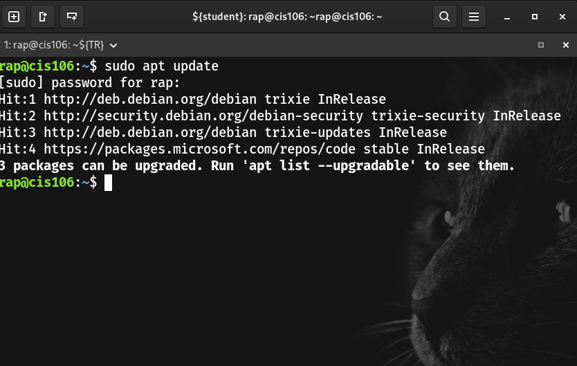
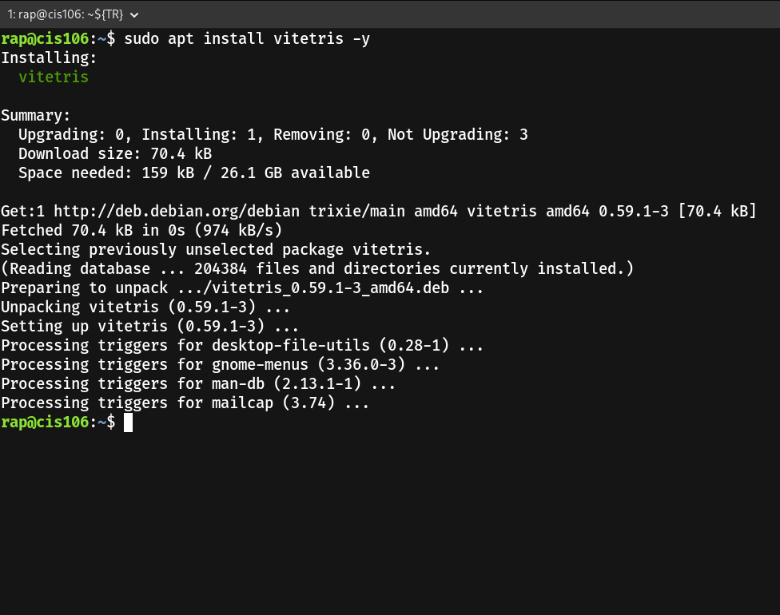
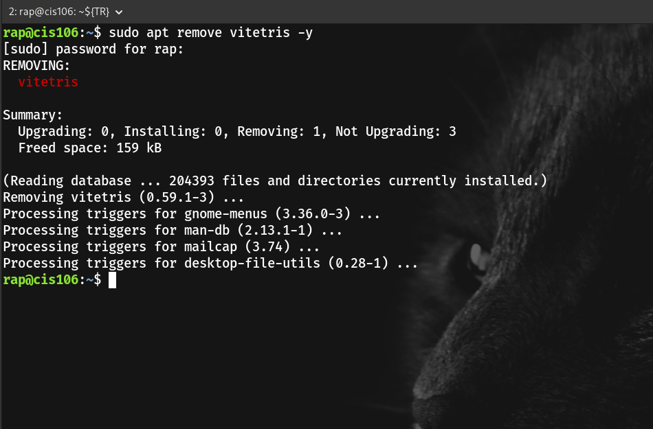
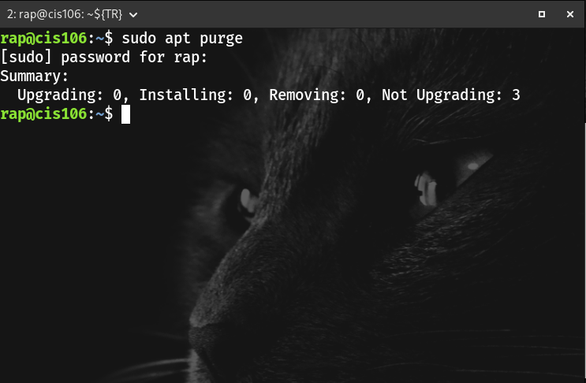
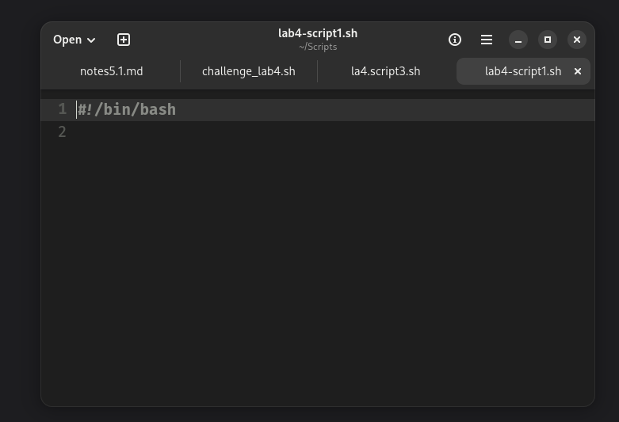
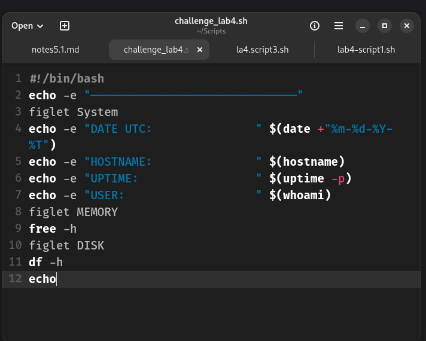
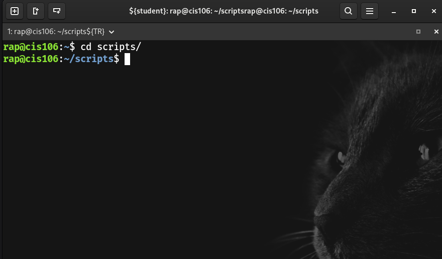
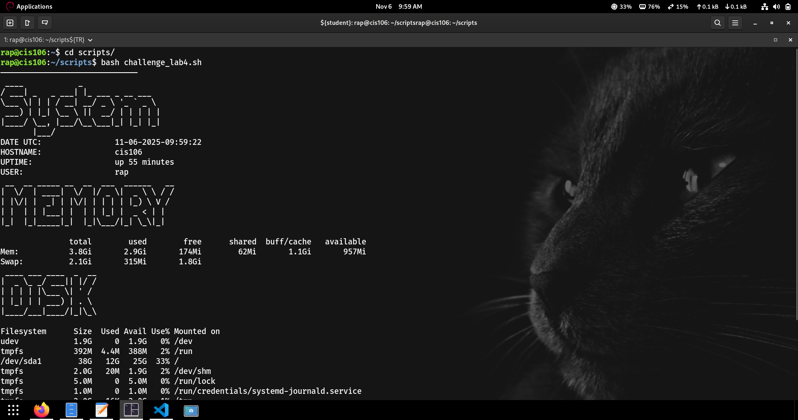

# Notes 4

## How to install and remove software using the APT command.

Installing Software with APT

  ##  Update the Package List

# Command sudo apt update

## Install package	
## Command sudo apt install <package>

## Remove package
## Command sudo apt remove <package>

## Command sudo apt purge <package>

## How to create a shell script step by step including screenshots and how to run it. 
# Pick a file for script

+ Gnome text edit 

+ Save as and name the shell script

## Open the shell script on the terminal

## Run it

