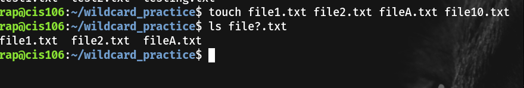
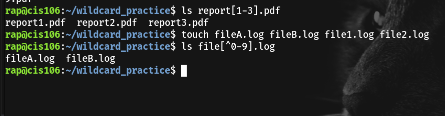
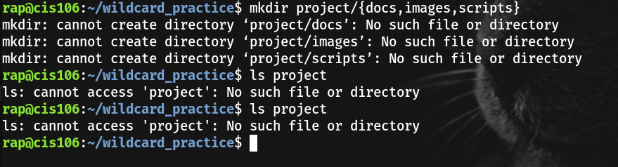
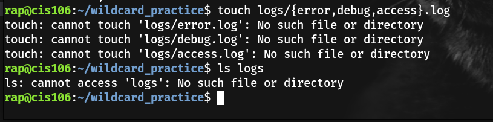

# Notes 7

## 1. Wildcards
+ Wildcard: * (Asterisk)

  + Definition:
Matches zero or more characters. It is the most flexible wildcard.

  + Examples:
  ls *.txt → lists all files ending in .txt

    * rm test* → deletes any file that starts with test
    (ex: test1, testfile, testing.txt)

    * cp * /backup/ → copies everything in the current directory
  
+ Wildcard: ? (Question Mark)
  + Definition:
Matches exactly one character.

  + Examples:

    *  ls file?.txt → matches file1.txt, fileA.txt, but not file10.txt

    * mv photo?.jpg images/ → moves files like photo1.jpg, photo2.jpg

    * cat log?.txt → matches logs log1.txt, log2.txt, etc.

+  Wildcard: [ ] (Character Class)

   +    Definition:
Matches one character from a list or range.

   +   Examples:

       *   ls report[123].pdf → matches report1.pdf, report2.pdf, report3.pdf

        *    rm file[a-c].txt → deletes filea.txt, fileb.txt, filec.txt

        *    cp img[0-5].png pics/ → matches images numbered 0–5

+ Wildcard: [^ ] (Negated Character Class)

   +  Definition:
Matches one character NOT inside the brackets.

  +  Examples:

     *    ls file[^0-9].txt → matches fileA.txt, fileB.txt, but not file1.txt

     *  rm test[^ab].log → deletes logs not ending in a or b

     *  mv doc[^s].md backup/ → moves files not ending in s
  

 +  Brace Expansion
    +   Definition:

        Brace expansion generates multiple strings before a command runs.
It is used to quickly create many files or directories, including full directory trees.

        *   Example 1: Create multiple directories
        *   mkdir project/{docs,images,scripts}

  +  Creates:

     project/docs

     project/images

      project/scripts

  + Example 2: Create entire folder structures
mkdir -p music/{jazz,rock,pop}/{mp3,ogg,flac}

Creates:

music/
 ├─ jazz/
 │   ├─ mp3
 │   ├─ ogg
 │   └─ flac
 ├─ rock/
 │   ├─ mp3
 │   ├─ ogg
 │   └─ flac
 └─ pop/
     ├─ mp3
     ├─ ogg
     └─ flac

  + Example 3: Create multiple files at once
touch logs/{error,debug,access}.log

   + Creates:

error.log

debug.log

access.log
